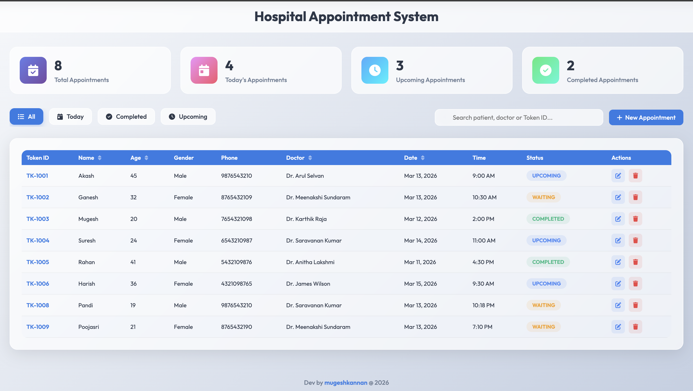
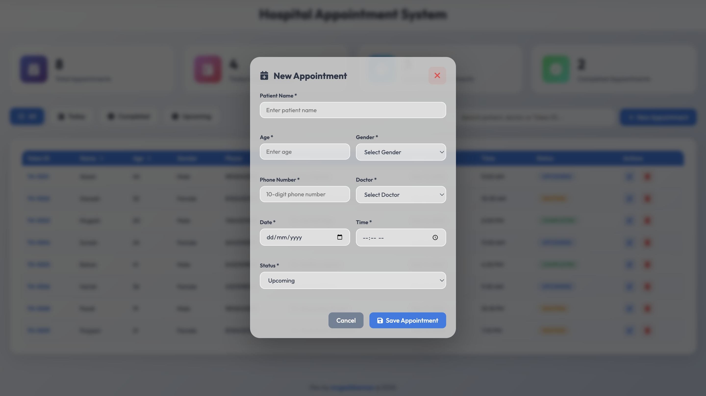

# Hospital Appointment Management System

web application designed for efficient hospital appointment management. 

## Key Features

- **Real-time Dashboard**: Instantly track Total, Today's, Upcoming, and Completed appointments.
- **Intelligent Scheduling**: 
    - Automatic **Token ID** generation (TK-1001 onwards).
    - **Conflict Prevention**: Enforces a minimum 10-minute gap between appointments for the same doctor.
    - **Status Management**: Track patients through *Upcoming*, *Waiting*, *Completed*, or *Cancelled* states.
- **Smart Data Handling**: 
    - **Live Search**: Filter through thousands of records by Patient Name, Doctor, or Token ID instantly.
    - **Tab Filtering**: Quick views for *Today*, *Upcoming*, and *Completed* appointments.
    - **Record Sorting**: Sort the table by Name, Age, Doctor, or Appointment Date/Time.
    - **Responsive Design**: Optimized for desktops, tablets, and mobile devices.
- **Data Persistence**: Uses Browser `LocalStorage` to ensure your data is saved across sessions without a database server.

## Tech Stack

- **Core**: HTML5
- **Styling**: CSS3
- **Logic**: JavaScript
- **Icons**: Font Awesome
- **Fonts**: Google Fonts

## Project Structure

```text
/New
├── index.html   
├── style.css    
├── script.js    
└── README.md    
```

## Getting Started

1. Clone or download the repository.

## output 




## Developer

Developed by **[Mugeshkannan](https://mugeshkannan.vercel.app)**
© 2026 Hospital Management Project

---
